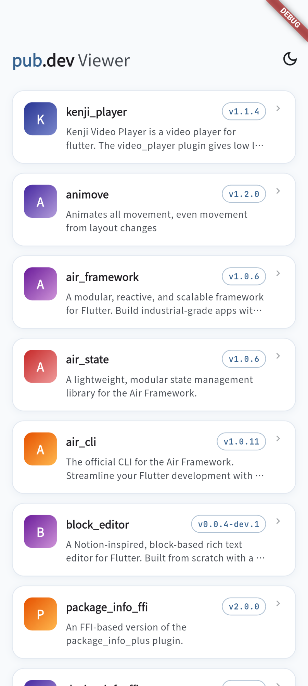
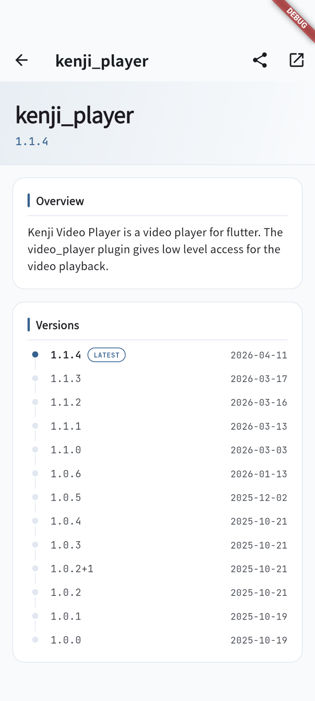

# pub.dev Viewer

[pub.dev](https://pub.dev) の Dart パッケージを閲覧する Flutter アプリ。Material Design 3 に準拠したクリーンな UI で、パッケージの検索・詳細確認・共有が行えます。

[](https://flutter.dev)
[](https://dart.dev)
[](https://flutter.dev)

## 機能

- **パッケージ一覧** — スケルトンローディングと引っ張り更新付きの無限スクロール一覧
- **パッケージ詳細** — 説明文、バージョン履歴（タイムライン表示）、パブリッシャー情報
- **共有・外部リンク** — パッケージをシェアしたり、ホームページ / リポジトリをブラウザで開く
- **ライト / ダークテーマ** — アプリバーからトグル切り替え
- **プラットフォーム対応 UX** — 触覚フィードバック、iOS バウンス、Android 予測的バック、セーフエリア対応

## スクリーンショット

| パッケージ一覧 | パッケージ詳細 |
|:---:|:---:|
|  |  |

## セットアップ

### 前提条件

- [Flutter](https://flutter.dev/docs/get-started/install)（[FVM](https://fvm.app) でバージョン管理）
- [FVM](https://fvm.app/docs/getting_started/installation) がグローバルにインストール済みであること

### インストール

```bash
# ピン留めされた Flutter バージョンをインストール
fvm install

# 依存パッケージを取得
fvm flutter pub get

# コード生成（freezed / Riverpod / GoRouter / JSON）
fvm dart run build_runner build --delete-conflicting-outputs
```

> [!NOTE]
> グローバルの `flutter` / `dart` コマンドではなく、必ず `fvm flutter` / `fvm dart` を使用してください。

### 実行

```bash
fvm flutter run
```

## アーキテクチャ

**Feature-First + Riverpod** によるレイヤー構造を採用しています。

```
lib/
├── app/               # MaterialApp、ルーティング（GoRouter）、テーマ
├── core/              # 共通基盤
│   ├── api/           #   Dio ベースの pub.dev API クライアント
│   ├── design_system/ #   デザイントークン（色、余白、角丸、影）
│   ├── error/         #   sealed AppException 階層
│   └── widgets/       #   共通ウィジェット（ErrorView、SkeletonListView）
└── features/
    ├── package_list/  # ホーム画面 — 一覧・ページネーション・状態管理
    └── package_detail/# 詳細画面 — 情報・バージョン・パブリッシャー
```

各 feature は `models/`、`repository/`、`notifiers/`、`screens/` で独立しています。feature 間の直接依存は禁止で、共通処理は `core/` に置きます。

**feature 内の依存方向：**
```
screens → notifiers → repository → models
```

## 技術スタック

| レイヤー | ライブラリ |
|---|---|
| 状態管理 | [flutter_riverpod](https://pub.dev/packages/flutter_riverpod) + [hooks_riverpod](https://pub.dev/packages/hooks_riverpod) + [flutter_hooks](https://pub.dev/packages/flutter_hooks) |
| ルーティング | [go_router](https://pub.dev/packages/go_router) |
| HTTP | [dio](https://pub.dev/packages/dio) |
| イミュータブルモデル | [freezed](https://pub.dev/packages/freezed) + [json_serializable](https://pub.dev/packages/json_serializable) |
| 国際化 / 日付フォーマット | [intl](https://pub.dev/packages/intl) |
| フォント | [google_fonts](https://pub.dev/packages/google_fonts)（Noto Sans JP、JetBrains Mono） |
| ローディングアニメーション | [shimmer](https://pub.dev/packages/shimmer) |
| レイアウト補助 | [gap](https://pub.dev/packages/gap) |
| 共有 / URL | [share_plus](https://pub.dev/packages/share_plus) + [url_launcher](https://pub.dev/packages/url_launcher) |
| ログ | [logging](https://pub.dev/packages/logging) |
| AI 操作 | [marionette_flutter](https://pub.dev/packages/marionette_flutter) + [marionette_logging](https://pub.dev/packages/marionette_logging) |

**コード生成（dev）：**

| ツール | 用途 |
|---|---|
| [build_runner](https://pub.dev/packages/build_runner) | コード生成の実行基盤 |
| [riverpod_generator](https://pub.dev/packages/riverpod_generator) | `@riverpod` アノテーションから Provider を生成（`.g.dart`） |
| [go_router_builder](https://pub.dev/packages/go_router_builder) | 型安全なルート定義を生成（`.g.dart`） |
| [freezed](https://pub.dev/packages/freezed) | イミュータブルモデルを生成（`.freezed.dart`） |
| [json_serializable](https://pub.dev/packages/json_serializable) | `fromJson` / `toJson` を生成（`.g.dart`） |

## テスト

```bash
fvm flutter test
```

### テスト構成

`lib/` の構造を `test/` 配下に鏡像します：

```
test/
├── helpers/
│   ├── fakes.dart      # Fake リポジトリ（Mockito Mock の代わりに使用）
│   └── fixtures.dart   # const JSON フィクスチャ
└── features/
    ├── package_list/
    │   ├── notifiers/  # Notifier ユニットテスト（ProviderContainer）
    │   └── repository/ # Repository ユニットテスト
    └── package_detail/
        ├── notifiers/
        └── repository/
```

### テスト方針

- **Mock 禁止** — `Fake implements XxxRepository` パターンを使用。`@GenerateMocks` は使わない
- **フィクスチャ** — テスト内にインライン JSON を書かず `test/helpers/fixtures.dart` を共有
- **ProviderContainer** — Notifier テストに使用。`tearDown` で必ず `container.dispose()`
- **Completer** — ローディング中の状態を検証するために future を保留して使用

## コード品質

```bash
# 静的解析
fvm dart analyze

# フォーマット（Edit / Write 後に PostToolUse hook で自動実行済み）
fvm dart format .
```

| ツール | 用途 |
|---|---|
| [pedantic_mono](https://pub.dev/packages/pedantic_mono) | 厳格な lint ルールセット |
| [riverpod_lint](https://pub.dev/packages/riverpod_lint) | Riverpod 固有の静的解析 |
| [custom_lint](https://pub.dev/packages/custom_lint) | カスタムリントの実行基盤 |

## AI 開発環境（Claude Code）

このプロジェクトは [Claude Code](https://claude.ai/code) での開発を前提としており、`.claude/` ディレクトリにプロジェクト固有の設定・カスタムスキルが含まれています。

### MCP Marionette

[Marionette](https://pub.dev/packages/marionette_flutter) により、Claude Code がデバッグモードの Flutter アプリを直接操作できます。UI 要素の検査・タップ・テキスト入力・スクリーンショット取得・ログ確認・ホットリロードが Claude Code から行えます。

**セットアップ：**

1. [marionette_mcp](https://pub.dev/packages/marionette_mcp) をグローバルインストール

   ```bash
   dart pub global activate marionette_mcp
   ```

2. アプリをデバッグモードで起動（VM サービス URI が出力される）

   ```bash
   fvm flutter run
   # → Connecting to VM Service at ws://127.0.0.1:XXXXX/ws
   ```

3. Claude Code から接続（`.mcp.json` で `marionette_mcp` サーバーが設定済み）

   ```
   mcp__marionette__connect で VM サービス URI を指定
   ```

`main.dart` でデバッグビルド時のみ `MarionetteBinding` を初期化しているため、リリースビルドへの影響はありません。

### カスタムスキル

`.claude/skills/` にプロジェクト固有のスキルが定義されています：

| スキル | 用途 |
|---|---|
| `pubdev-new-feature` | 新規 feature の追加ステップバイステップガイド |
| `pubdev-state` | AsyncNotifier パターン・ページネーション・状態管理 |
| `pubdev-models` | Freezed + json_serializable モデルパターン |
| `pubdev-testing` | テストパターン（Fake・Notifier・Widget） |
| `pubdev-ui` | デザイントークン・テーマ・Widget パターン |

### 自動フォーマット（PostToolUse hook）

`.claude/settings.json` の `PostToolUse` hook により、ファイル編集後に `fvm dart format .` が自動実行されます。手動でのフォーマットは原則不要です。

## API

pub.dev の公開 REST API からデータを取得します。OpenAPI スキーマは [docs/openapi.yaml](docs/openapi.yaml) を参照してください。

| エンドポイント | 説明 |
|---|---|
| `GET /api/packages` | パッケージ一覧（ページネーション付き） |
| `GET /api/packages/{name}` | パッケージ詳細とバージョン |
| `GET /api/packages/{name}/publisher` | パブリッシャー情報 |
