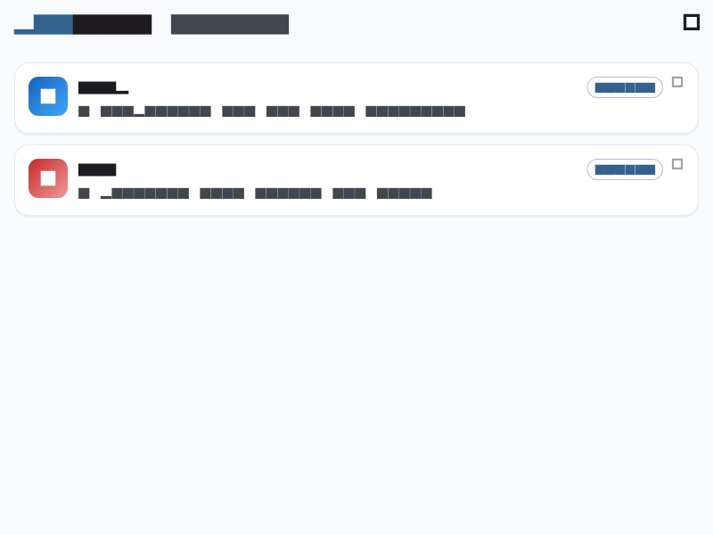
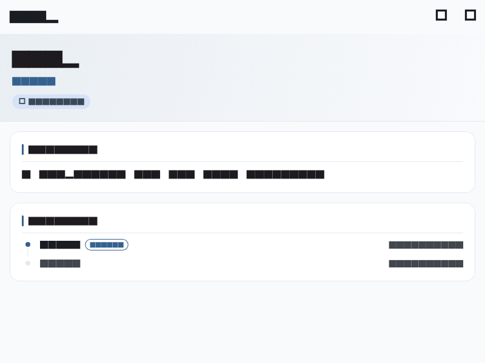

# pub.dev Viewer

A Flutter app for browsing Dart packages on [pub.dev](https://pub.dev). Explore the package registry with a clean, platform-aware UI built with Material Design 3.

[](https://flutter.dev)
[](https://dart.dev)
[](https://flutter.dev)

## Features

- **Package list** — Paginated, infinite-scroll list of pub.dev packages with skeleton loading and pull-to-refresh
- **Package detail** — Full details including description, version history (timeline view), and publisher information
- **Share & open** — Share packages or open their homepage/repository in a browser
- **Light / Dark theme** — Toggle from the app bar; persists via Riverpod state
- **Platform-aware UX** — Haptic feedback, iOS bouncing physics, Android predictive back gesture, proper safe-area handling

## Screenshots

| Package List | Package Detail |
|:---:|:---:|
|  |  |

## Getting Started

### Prerequisites

- [Flutter](https://flutter.dev/docs/get-started/install) (managed via [FVM](https://fvm.app))
- [FVM](https://fvm.app/docs/getting_started/installation) installed globally

### Setup

```bash
# Install the pinned Flutter version
fvm install

# Get dependencies
fvm flutter pub get

# Run code generation (freezed, Riverpod, GoRouter, JSON)
fvm dart run build_runner build --delete-conflicting-outputs
```

### Run

```bash
fvm flutter run
```

> [!NOTE]
> Always use `fvm flutter` / `fvm dart` instead of the global `flutter` / `dart` commands to ensure the correct SDK version is used.

## Architecture

The app follows a **Feature-First + Riverpod** layered structure:

```
lib/
├── app/               # MaterialApp, routing (GoRouter), theme
├── core/              # Shared infrastructure
│   ├── api/           #   Dio-based pub.dev API client
│   ├── design_system/ #   Design tokens (colors, spacing, radius, shadows)
│   ├── error/         #   Sealed AppException hierarchy
│   └── widgets/       #   Shared UI components (ErrorView, SkeletonListView)
└── features/
    ├── package_list/  # Home screen — list, pagination, state
    └── package_detail/# Detail screen — info, versions, publisher
```

Each feature is self-contained with its own `models/`, `repository/`, `notifiers/`, and `screens/` layers. Cross-feature dependencies are prohibited; shared code lives in `core/`.

**Dependency direction within a feature:**
```
screens → notifiers → repository → models
```

## Tech Stack

| Layer | Library |
|---|---|
| State management | [flutter_riverpod](https://pub.dev/packages/flutter_riverpod) + [hooks_riverpod](https://pub.dev/packages/hooks_riverpod) |
| Routing | [go_router](https://pub.dev/packages/go_router) |
| HTTP | [dio](https://pub.dev/packages/dio) |
| Immutable models | [freezed](https://pub.dev/packages/freezed) + [json_serializable](https://pub.dev/packages/json_serializable) |
| Fonts | [google_fonts](https://pub.dev/packages/google_fonts) (Noto Sans JP, JetBrains Mono) |
| Loading animation | [shimmer](https://pub.dev/packages/shimmer) |
| Share / URL | [share_plus](https://pub.dev/packages/share_plus) + [url_launcher](https://pub.dev/packages/url_launcher) |

## Testing

```bash
# Unit & widget tests
fvm flutter test

# Integration tests (requires a running device/emulator)
fvm flutter test integration_test
```

Golden images are stored under `test/**/goldens/` and serve as visual regression baselines.

## API

Package data is fetched from the public pub.dev REST API. The full OpenAPI schema is at [docs/openapi.yaml](docs/openapi.yaml).

| Endpoint | Description |
|---|---|
| `GET /api/packages` | Paginated package list |
| `GET /api/packages/{name}` | Package details and versions |
| `GET /api/packages/{name}/publisher` | Publisher information |
